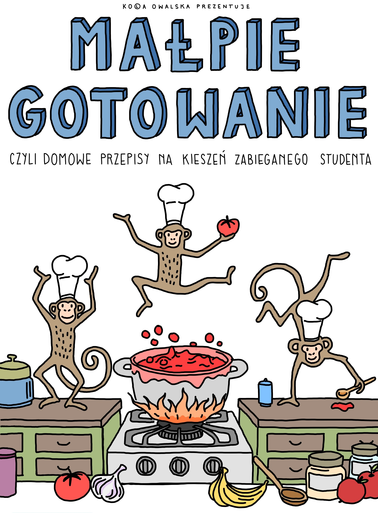

# monkey-cooks 

this repository contains a latex-based cookbook with simple and budget-friendly recipes written by me :)

### how to use
- **download the pdf**: the `malpie_gotowanie.pdf` file renders automatically via github actions, so you can simply download it to view the book
- **build from source**: alternatively, you can clone the repo and run the latex source files to generate the pdf yourself 

